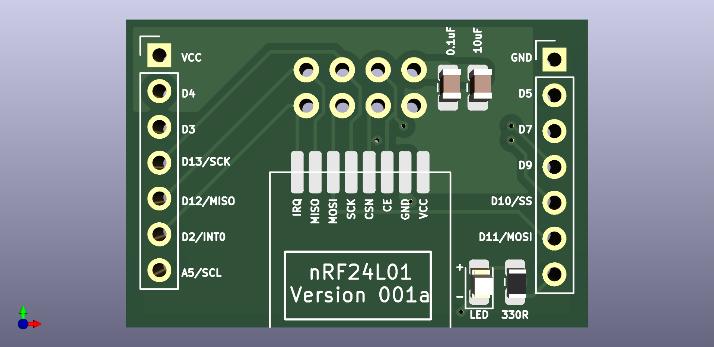
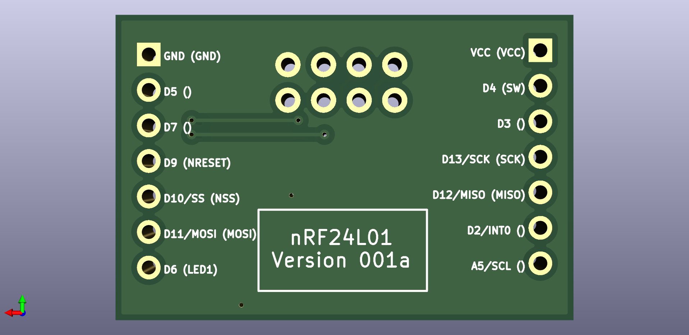

# README

The basis of this project is not mine but is derived from the work of the MySensors forum user, [NeverDie](https://forum.mysensors.org/user/neverdie). The [related forum thread](https://forum.mysensors.org/topic/11954/most-reliable-best-radio) is a discussion and progression of building a test platform for testing RF radio modules, as well as a discussion of testing those radio modules.  

This repository is meant merely as a way to backup my work and to share my copy/version of the pieces of the project that I'm interested in.  It is also a minor test of using git with KiCad files.

I considered using [this article](https://medium.com/inventhub/better-manage-kicad-projects-using-git-8d06e1310af8) as a guideline for building this repository but decided that it was more structure that was needed for this project.  Linking it here for posterity and my own future reference.

You can find NeverDie's [original schematic](assets/schematic_v001.pdf) in the assets folder.

Here is what this particular radio module shield board looks like.

Top

and Bottom
